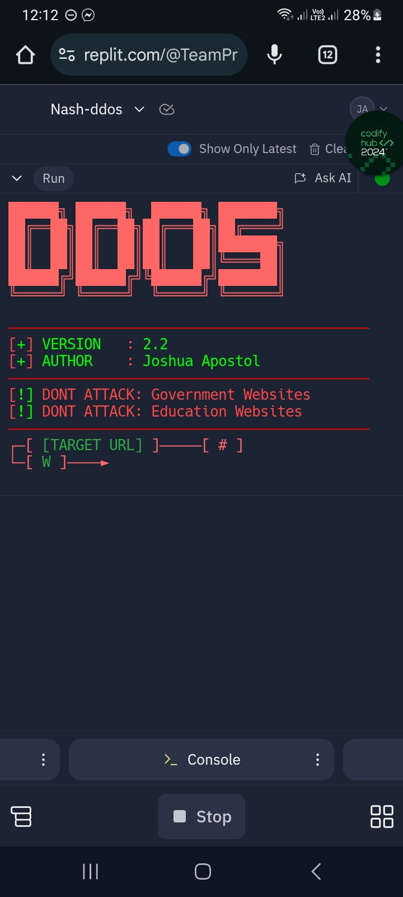
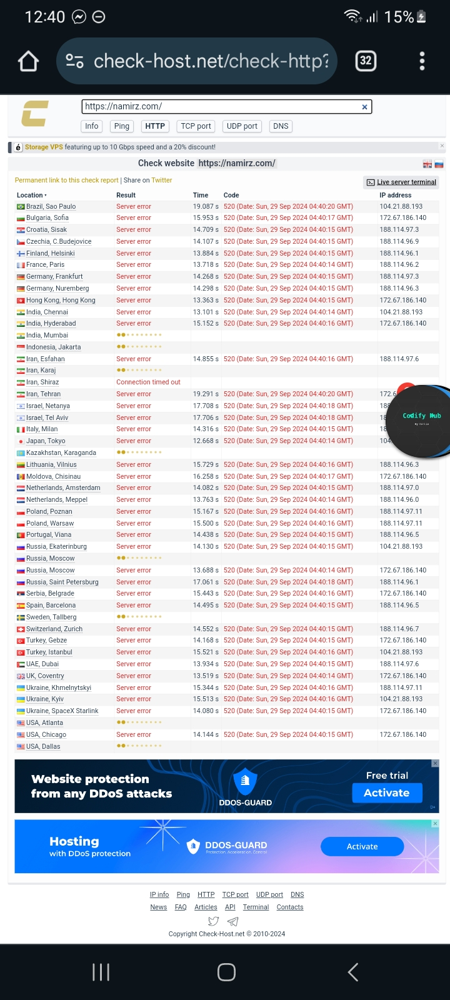

# DDOS
This is a DDoS attack made by joshua Apostol if you wan't to use this ddos attack please do not attack the gov and edu website.

## TESTED ON
Termux ✅️
replit✅️
cloudshell✅️

# INSTALLATION
```
npm install axios && socks-proxy-agent && https-proxy-agent && readline
```
```
git clone https://github.com/joshuaApostol2/Nash-ddos
```
```
cd Nash-ddos
```
```
node index.js
```

## PROOF



